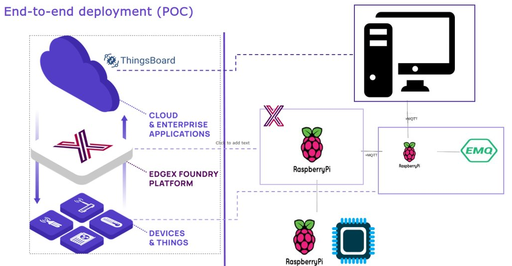
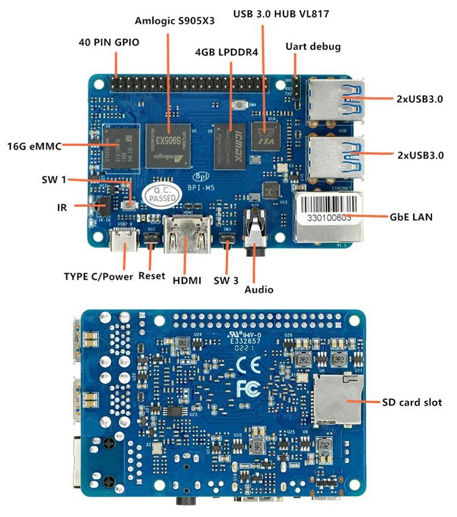
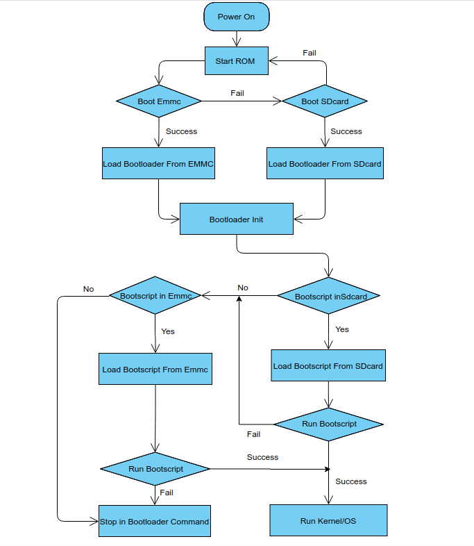
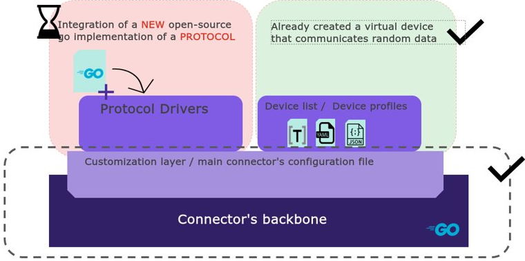

# **End-to-end deployment - EdgeX device service Implementation**

This repository contains the device service implemented on the BPI-M5 in the context of the end-to-end IoV deployment project.
<br>
This Readme file contains a tutorial on how to install EdgeX and gow to create this particular device service and how it works.

## **Context**
The IoV end-end deployment project is an implementation of the three layers of the IoV architecture using EdgeX for the Middleware and ThingBoard as Cloud plateform. 
<br>
At the thingBoard level there is a predictive maintenance framework using digital twins that runs Machine Learning algorithms. 
<br>
The algorithms trained on certain datasets, and our role at the device service layer is to send the validation datatset, line by line to the Cloud server so that it can be used to evaluate the predictive algorithms.
The topology proposition can be found [Here.](https://ardianet.sharepoint.com/:w:/r/sites/Group_SSESolutionFactory_RetD/Documents%20partages/General/01%20-%20R%26D/AD%20-%20IoV/06-Internships/2022/00%20-%20Abstraction%20Layer/03_Deliverables/Internal/End-to-end%20deployment%20-%20Topology%20proposition.docx?d=w5120258badcf4947a16f5e79bb7f9365&csf=1&web=1&e=dlfw1y) 



## **Hardware specifications**

For the hardware target on which to implement EdgeX on, the choice leaned towards a Banana Pi-M5 which is the equivalent of the Raspberry Pi 4-B. This choice is the consequence of the lack of semiconductor chipsets on the market which caused the Ras-Pi to go out of stock (July 2022). 

The Banana Pi BPI-M5 is the new generation single board computer from Banana Pi, it was released in 2020. 
It's main specs are the following: 

|              | Hardware Specifications                                                            |
|---------------------|------------------------------------------------------------------------------------------------------------|
| **CPU**             | Amlogic S905X3 Quad-Core Cortex-A55 (2.0xxGHz)                                                             |
| **GPU**             | Mali-G31 MP2 GPU with 4 x Execution Engines (650Mhz)                                                       |
| **Memory**          | 4 GB LPDDR4                                                                                                |
| **Storage**         | MicroSD slot with support for up to 256GB expansion and 16G eMMC flash with support for up to 64GB         |
| **Network**         | 10/100/1000 Mbit/s Ethernet ,Optional WiFi USB dongle                                                      |
| **Video Output(s)** | 1 x HDMI 2.0 (up to 4K@60Hz with HDR, CEC, EDID)                                                           |
| **Audio Output(s)** | 3.5mm jack and 1 x HDMI digital output                                                                     |
| **USB ports**       | USB 3.0 PORT (x4)                                                                                          |
| **GPIO**            | 40 Pin Header : GPIO (x28) and Power (+5V, +3.3V and GND). GPIO pins can be used for UART, I2C, SPI or PWM |
| **Switches**        | Reset, Power and U-boot                                                                                    |
| **LED**             | Power Status and Activity status                                                                           |
| **Power Source**    | 5 volt @3A via Micro USB (TYPE C)                                                                          |
| **Size & Weight**   | 92x60mm, 48g                                                                                               |
| **OS**              | Android and Linux                                                                                          |
## **Hardware interface**


## **Development prequisites**
1.  Prepare a usb-serial cable, a 5V/3A adaptor type-c power supply. The serial cable is used for console debug and type-c cable is used for android image download and ADB debug. 
2.  Prepare a SDcard at least 32GB for linux development.
3.  The SOC rom first boot media is emmc, so board can't bootup from SDcard if the emmc is bootable with any image flashed, more info please refer to board boot sequence.
4.  In Android SDcard is mmc0, emmc is mmc1, but in Linux SDcard is mmc1, emmc is mmc0.
   
## **Linux installation guide**
### **Boot sequence**
<!--[](https://mermaid.live/edit#pako:eNqFUstuwyAQ_BXEqZUS9e5DpTp2Hs7DVdxLZfeAADdIBiyMVVV2_r0Yk4RGVssJ7czszC50EEtCYQA_FapP4C0qBDDn5eFVflEFUvEI5vNnEOaZRkqDY7r_GBmhrS-6UEoNYs7xeawvbL0vEat6EI1wFoEFUsRn9FmLMW2aHsT5TiICBmJlLsa0VJLbls4qGlteFatphXNxotiKlrnH2gimHbr6E3WGSztDONaWtra2AzVYsVoDJu4mW4-6d2pCbm4hHX0ipBMcZA-Su87eSpMba2veQdYD7iXHknMkLj0TL8RuOoS3251l77tjKzyaM95Y8DANHvwlJb9q15dK80G6pUrQ6inNnOf-HxacQU4VR4yYf9kNmgLqE-W0gIG5ElqittIFLMTZUNuaIE1jwrRUMChR1dAZRK2W2bfAMNCqpRdSxJD55tyxzj-znvGe)-->



### **Preparation for Boot**
1.  Linux image support SDcard or EMMC bootup, but you should read the boot sequence at first.

2. Make sure bootable EMMC is formatted if you want bootup from SDcard, more info refer to Erase EMMC for SDcard Bootup

3. Make sure SDcard is formatted without Linux image flashed if you want bootup from EMMC and use Sdcard as storage.

4. Install bpi-tools on your Linux PC(if flash image with other tools, ignore this step). If you can't access this URL or any other install problem, please go to bpi-tools source repo, download and install this tools manually.
```bash
 $ apt-get install pv
 $ curl -sL https://github.com/BPI-SINOVOIP/bpi-tools/raw/master/bpi-tools | sudo -E bash
```
5. Download Linux latest Linux Image, and confirm that the md5 checksum is correct.
6. Default login: **pi/bananapi** or **root/bananapi**
### **ISO burn**
Install Image with dd command on Linux, umount SDcard device /dev/sdX partition if mounted automatically. Actually bpi-copy is the same as this dd command.
```bash
 $ sudo apt-get install pv unzip
 $ sudo unzip -p xxx-bpi-m5-xxx.img.zip | pv | dd of=/dev/sdX bs=10M status=noxfer
```
You have to make sure that you replace sdX with your SD Card peripheral name. 

### **Ubuntu server 20.04 pre-configuration**
#### **Real-Time clock**
The BPI-M5 does not embedd a Real-Time Clock on its hardware. To fix this issue and have a synchronzied clock we will run a command at each launch. For this command to run automatically at every restart, we will write it in the ~/.BASHRC file. 
```bash
yourlogin ALL=(ALL) NOPASSWD: sudo date -s "$(wget -qSO- --max-redirect=0 google.com 2>&1 | grep Date: | cut -d' ' -f5-8)Z"
```
#### **Keyboard language**

Using 
```bash
sudo dpkg-reconfigure keyboard-configuration 
```
or 
```bash
loadkeys fr
```
will change your keyboard layout just for this session. <br>
For the configuration to be permanent:
```bash
sudo nano /etc/default/keyboard 
```
there you can change your keyboard settings.
Find the line: <br>  
```command
XKBLAYOUT="xx" and replace with "fr".
```
## **GO 1.18 installation guide**
You can find a complete tutorial [Here](https://nextgentips.com/2021/12/23/how-to-install-go-1-18-on-ubuntu-20-04/)
## **Docker-desktop installation guide**
You can find a complete tutorial [Here](https://docs.docker.com/desktop/install/ubuntu/)
This package version of Docker already contains Docker-compose.
## **EdgeX for ARM64 installation guide**
To install EdgeX for ARM64, we need to download the Docker-compose file for ARM64 with no security and then edit it to make sure that we remove the device services. 
```bash
curl https://raw.githubusercontent.com/edgexfoundry/developer-scripts/master/releases/jakarta/compose-files/docker-compose-jakarta-redis-no-secty-arm64.yml -o docker-compose.yml; docker-compose up
```
## **EdgeX hybrid mode launch and Device service launch**
You can find the detailed implementation steps in this [Tutorial](https://ardianet.sharepoint.com/:w:/r/sites/Group_SSESolutionFactory_RetD/Documents%20partages/General/01%20-%20R%26D/AD%20-%20IoV/06-Internships/2022/00%20-%20Abstraction%20Layer/03_Deliverables/Internal/Development%20-%20Building%20an%20EdgeX%20Device%20Service%20tutorial%20.docx?d=w6323cb663abf471bbcb509fc6e923365&csf=1&web=1&e=zrY2jg). 
## **Device service configuration**


### **DeviceList TOML file**
We configurate the device list, adding a device called "Battery" to our TOML file, along with some important metadata information. It is important to specify the right device profile. <br>
We then create an AutoEvent that calls a command named "battery-data" that performs a REST /GET command to retrieve the needed data with a 30s interval between each line from the dataset.

```toml
[[DeviceList]]
  Name = "Battery"
  ProfileName = "Battery-profile"
  Description = "NASA validation dataset of the battery data"
  Labels = [ "" ]
  [DeviceList.Protocols]
  [DeviceList.Protocols.other]
    Address = "simple01"
    Port = "300"
  [[DeviceList.AutoEvents]]
    Interval = "30s"
    OnChange = false
    SourceName = "battery-data" 
```


### **Device profile YAML file**
The device profile defines all of the resources featured in the validation dataset, as well as a command called "battery-data" that performs a GET of all the resources.
```yaml
apiVersion: "v2"
name: "Battery-profile"
manufacturer: "NASA"
model: "Validation-dataset"
labels:
  - "NASA"
  - "Expleo Group"
  - "EdgeX"
  - "Battery"
  - "Thingboard"
  - "IoV"
  - "Nephido"
  - "Predictive maintenance"
  - "Abstraction layer"
  - "End-to-end deployment"
description: "This profile describes the NASA dataset resources"
deviceResources:
  -
    name: "Cycle"
    isHidden: false
    description: "Discharge cycle Id"
    properties:
        valueType: "Int64"
        readWrite: "RW"
        units: "No unit" 
  -
    name: "Voltage_measured"
    isHidden: false
    description: "measure of the ouptut voltage"
    properties:
        valueType: "Float64"
        readWrite: "RW"
        units: "Volts"
  -
    name: "Current_measured"
    isHidden: false
    description: "measure of the ouput current"
    properties:
        valueType: "Float64"
        readWrite: "RW"
        units: "Ampers"
  -
    name: "Temperature_measured"
    isHidden: false
    description: "measure of the surrounding temperature"
    properties:
        valueType: "Float64"
        readWrite: "RW"
        units: "Celcius"
  -
    name: "Voltage_load"
    isHidden: false
    description: "voltage measure at the load"
    properties:
        valueType: "Float64"
        readWrite: "RW"
        units: "Volts"
  -
    name: "Time"
    isHidden: false
    description: "Time of the measure in seconds"
    properties:
      valueType: "Float64"
      readWrite: "RW"
      units: "Seconds"
  -
    name: "Current_load"
    isHidden: false
    description: "Current flowing through the load"
    properties:
        valueType: "Float64"
        readWrite: "RW"
        units: "Ampers"
  -
    name: "Capacity"
    isHidden: false
    description: "Capacity of the battery"
    properties:
      valueType: "Float64"
      readWrite: "RW"
      units: "Farads"

deviceCommands:
  -
    name: "battery-data"
    isHidden: false
    readWrite: "RW"
    resourceOperations:
      - { deviceResource: "Cycle"}
      - { deviceResource: "Voltage_measured"}
      - { deviceResource: "Current_measured"}
      - { deviceResource: "Temperature_measured"}
      - { deviceResource: "Voltage_load"}
      - { deviceResource: "Time"}
      - { deviceResource: "Current_load"}
      - { deviceResource: "Capacity"}
```
### **Driver implementation**
We need to make sure that we import the csv library:
```golang
"encoding/csv"
```
We add the following code to the Initialize function:
```golang
	///////////////////////////////////////////////////////////

	csvFile, err := os.Open("B0006.csv")
	if err != nil {
		return fmt.Errorf("unable to open csv file: %s", err.Error()) //////Loading the CSV dataset file in memory
	}
	defer csvFile.Close()

	s.line_index = 1
	s.csvLines, err = csv.NewReader(csvFile).ReadAll()
	if err != nil { ///////Creation of the Index to the retrieve the lines + reading of the all the lines thanks to ReadAll function

		return fmt.Errorf("unable to load csv information %s", err.Error())
	}
	///////////////////////////////////////////////////////////
```
Then we add the following code to the HandeReadCommands function:

We basically verrify that the number of GET requests is superior to zero (8 in our case) and the we create a **res** array that is declared as an output of the **HandeReadCommands** function and that contains our readings.
We then instanciate an intermediary variable **out** that contains the reading of the hole line according to the line_index.

After that, we create variables that represent each reading and use converters to set them to the right Data Type. 

Finally, we loop a switch case that checks, for every request, the **Resource Name** and feeds the **res** array with the proper data.
```golang
// HandleReadCommands triggers a protocol Read operation for the specified device.
func (s *SimpleDriver) HandleReadCommands(deviceName string, protocols map[string]models.ProtocolProperties, reqs []sdkModels.CommandRequest) (res []*sdkModels.CommandValue, err error) {
	s.lc.Debugf("SimpleDriver.HandleReadCommands: protocols: %v resource: %v attributes: %v", protocols, reqs[0].DeviceResourceName, reqs[0].Attributes)

	if len(reqs) != 0 {
		res = make([]*sdkModels.CommandValue, 8)
		var cv *sdkModels.CommandValue
		var ranges [8]int
		out := s.csvLines[s.line_index]
		s.line_index += 1

		//index, err := strconv.ParseInt(out[0], 10, 64)
		Cycle, err := strconv.ParseInt(out[1], 10, 64)
		Voltage_measured, err := strconv.ParseFloat(out[2], 64)
		Current_measured, err := strconv.ParseFloat(out[3], 64)
		Temperature_measured, err := strconv.ParseFloat(out[4], 64)
		Voltage_load, err := strconv.ParseFloat(out[5], 64)
		Time, err := strconv.ParseFloat(out[6], 64)
		Current_load, err := strconv.ParseFloat(out[7], 64)
		Capacity, err := strconv.ParseFloat(out[8], 64)

		for i := range ranges {

			if err == nil {
				switch reqs[i].DeviceResourceName {
				case "Cycle":
					cv, _ = sdkModels.NewCommandValue(reqs[i].DeviceResourceName, common.ValueTypeInt64, Cycle)
				case "Voltage_measured":
					cv, _ = sdkModels.NewCommandValue(reqs[i].DeviceResourceName, common.ValueTypeFloat64, Voltage_measured)
				case "Current_measured":
					cv, _ = sdkModels.NewCommandValue(reqs[i].DeviceResourceName, common.ValueTypeFloat64, Current_measured)
				case "Temperature_measured":
					cv, _ = sdkModels.NewCommandValue(reqs[i].DeviceResourceName, common.ValueTypeFloat64, Temperature_measured)
				case "Voltage_load":
					cv, _ = sdkModels.NewCommandValue(reqs[i].DeviceResourceName, common.ValueTypeFloat64, Voltage_load)
				case "Time":
					cv, _ = sdkModels.NewCommandValue(reqs[i].DeviceResourceName, common.ValueTypeFloat64, Time)
				case "Current_load":
					cv, _ = sdkModels.NewCommandValue(reqs[i].DeviceResourceName, common.ValueTypeFloat64, Current_load)
				case "Capacity":
					cv, _ = sdkModels.NewCommandValue(reqs[i].DeviceResourceName, common.ValueTypeFloat64, Capacity)
				}
			}

			res[i] = cv
		}
	}
	return
}
```
### **Result**
The received JSON event reading looks like this:
```json
apiVersion    :    v2
id    :    c894b444-29c1-4a92-bca4-dbde47661a95
deviceName    :    Battery
profileName    :    Battery-profile
sourceName    :    battery-data
origin    :    1659897447521888500
readings		
  0
	  id      :    d6ea3421-1722-4bc3-ac37-250e405f0a4c
    origin    :    1659897447521888500
    deviceName    :    Battery
    resourceName    :    Cycle
    profileName    :    Battery-profile
    valueType    :    Int64
    value    :    1
  1
    id      :    d5b2e37d-d0b2-4545-a658-1ba722274606
    origin      :	    1659897447521888500
    deviceName      :	    Battery
    resourceName      :	    Voltage_measured
    profileName      :	    Battery-profile
    valueType      :	    Float64
    value      :	    3.821684e+00
  2
    id      :	    6f9da7bc-b277-4523-a0cb-b25d44df0499
    origin      :	    1659897447521888500
    deviceName      :	    Battery
    resourceName      :	    Current_measured
    profileName      :	    Battery-profile
    valueType      :	    Float64
    value      :	    -2.010837e+00
  3
    id      :	    c73cb6e3-d925-4758-b8c9-4ed0cb5ecf91
    origin      :	    1659897447521888500
    deviceName      :	    Battery
    resourceName      :	    Temperature_measured
    profileName      :	    Battery-profile
    valueType      :	    Float64
    value      :	    2.716372e+01
  4
    id      :	    7169906b-b9bd-4ee1-a622-e798cee05e3e
    origin      :	    1659897447521888500
    deviceName      :	    Battery
    resourceName      :	    Voltage_load
    profileName      :	    Battery-profile
    valueType      :	    Float64
    value      :	    2.923000e+00
  5
    id      :	    e5302eeb-f2ea-4f1f-99de-f666fa8dff8e
    origin      :	    1659897447521888500
    deviceName      :	    Battery
    resourceName      :	    Time
    profileName      :	    Battery-profile
    valueType      :	    Float64
    value      :	    3.447500e+02
  6
    id      :	    f668a6b6-1ea2-43c0-90b6-21c3f8901c17
    origin      :	    1659897447521888500
    deviceName      :	    Battery
    resourceName      :	    Current_load
    profileName      :	    Battery-profile
    valueType      :	    Float64
    value      :	    -1.999000e+00
  7
    id      :	    c29ef947-0d9d-4b56-9b98-e5808c9ac5e9
    origin      :    1659897447521888500
    deviceName      :	    Battery
    resourceName      :	    Capacity
    profileName      :	    Battery-profile
    valueType      :	    Float64
    value      :	    2.035338e+00
```


## **License**
Expleo group France